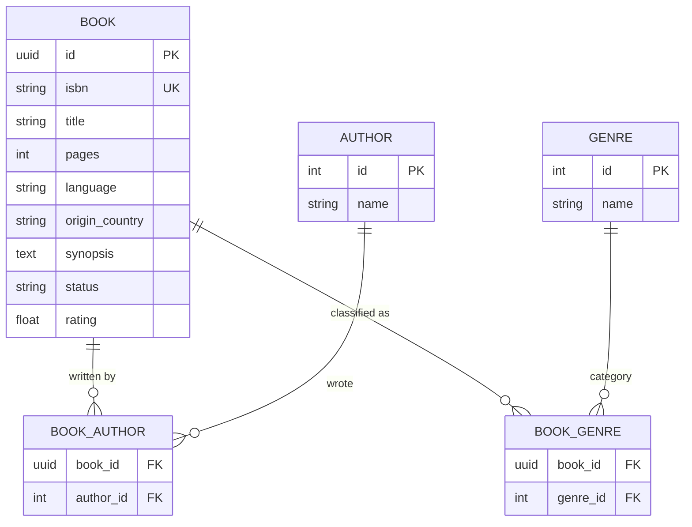

# My Library

## Docker Setup

This project uses Docker to run PostgreSQL database and Adminer for database management.

### Prerequisites

- Docker installed on your system
- Docker Compose installed

### Getting Started

1. **Clone the repository** (if not already done):
   ```bash
   git clone <your-repo-url>
   cd mylibrary
   ```

2. **Start the services**:
   ```bash
   docker-compose up -d
   ```

3. **Access Adminer**:
   - Open your browser and go to `http://localhost:8080`
   - Use the following connection details:
     - **System**: PostgreSQL
     - **Server**: postgres
     - **Username**: mylibrary_user
     - **Password**: mylibrary_password
     - **Database**: mylibrary_db

### Database Details

- **PostgreSQL Port**: 5432
- **Adminer Port**: 8080
- **Database Name**: mylibrary_db
- **Username**: mylibrary_user
- **Password**: mylibrary_password

### Docker Commands

- **Start services**: `docker-compose up -d`
- **Stop services**: `docker-compose down`
- **View logs**: `docker-compose logs`
- **Rebuild and restart**: `docker-compose up -d --build`

### Data Persistence

Database data is stored in a Docker volume (`postgres_data`), so your data will persist between container restarts.


## Database Architecture

The project uses a normalized relational schema to ensure data integrity and facilitate future statistical analysis (e.g., reading habits by country, genre, or language).

### Entity-Relationship Diagram (ERD)



### Data Dictionary
- Books: Core information including ISBN, status, and personal ratings.
- Authors & Genres: Separated tables with Many-to-Many relationships to allow a book to have multiple authors or categories.
- Enums: Reading status is managed via PostgreSQL ENUM types (WANT_TO_READ, READING, READ, etc.).